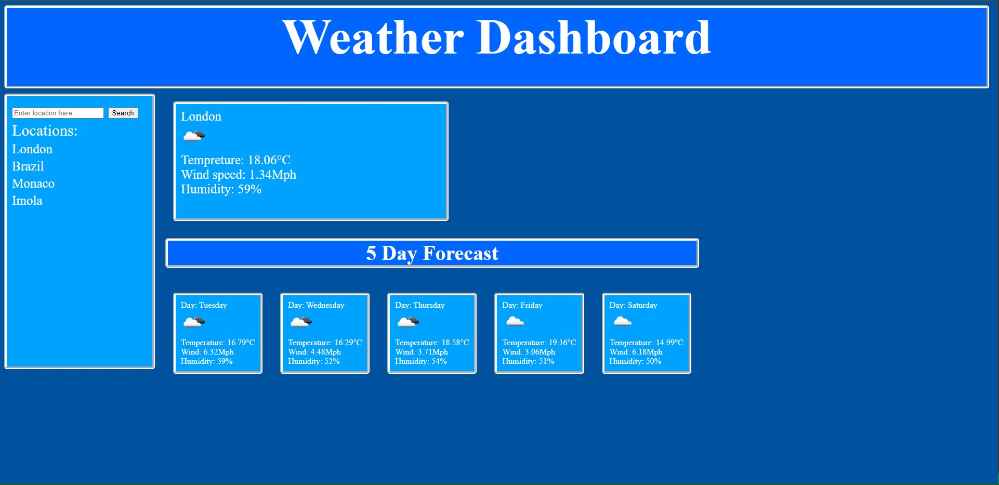

# week-6-server-side-API-weather-dashboard

## Description
This is a website that provides users with the current weather for any location they search for using the search bar. Once they search for their chosen location it will provide the user with the current temperature, wind speed, and humidity of that location as well as a small icon that indicates what the weather is doing. For example, it may show an icon with the sun if the weather is sunny, or could be a cloud with rain droplets to identify that it's raining. I've also provided the same information for the following five days so they can see the forecast weather. 

Once the user has searched for a location I've included a function that saves their recently searched locations into the local storage and then is displayed underneath the search bar which allows the user to click on it and as a result shows them the information for that location quickly.

I've created this weather dashboard using the https://openweathermap.org API which allows me to pull the relevant information and then display it in my weather dashboard. I also had to use the OpenWeatherMap website to create an API key that allows a connection from that website to mine to use the information.

## Images and Links 

Link to deployed webpage : https://adam-smart.github.io/week-6-server-side-API-weather-dashboard/